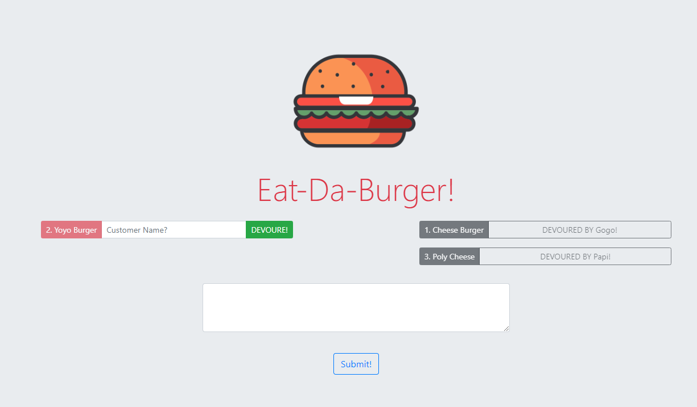

# Burger using Sequelize as MySQL-ORM 

# Overview
This application is an upgraded version of "Burger-manual-ORM"  as it's re to  is a burger logger using NodeJS with MySQL, Express, Handlebars and homemade ORM for Database Query handling.

In this assignment, I'm going to Sequelize the `Burger` app that made in the last unit. As this assynment will replace the usage of the regular MySQL to the `Sequelize` npm package which is an ORM oriented library and gives the ease to the developer for any more integration. This assignment is solved to the third challenge tier.

